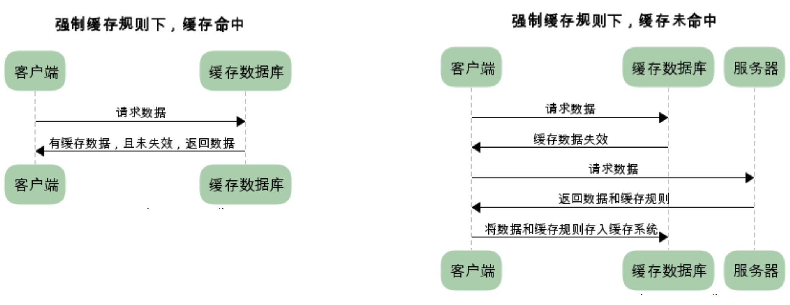

## HTTP ---- HTTP缓存机制

## 前言

缓存机制无处不在，有客户端缓存，服务端缓存，代理服务器缓存等。在HTTP中具有缓存功能的是浏览器缓存。HTTP缓存作为web性能优化的重要手段，对于从事web开发的朋友有重要的意义。本文将围绕以下几个方面来整理HTTP缓存。

- 缓存的规则
- 缓存的方案
- 缓存的优点
- 不同刷新的请求执行过程

## 缓存的规则

我们知道HTTP的缓存属于客户端缓存，后面会提到为什么属于客户端缓存。所以我们认为浏览器存在一个缓存数据库，用于储存一些不经常变换的静态文件（图片、css、js等）。我们将缓存分为强制缓存和协商缓存。下面我将分别详细的介绍这两种缓存的缓存规则。

## 强制缓存

当缓存数据库中已有所请求的数据时。客户端直接从缓存数据库中获取数据。当缓存数据库中没有所请求的数据时，客户端的才会从服务器端获取数据

;

## 协商缓存

又称对比缓存，客户端会先从缓存数据库中获取到一个缓存数据的标识，得到标识后请求服务端验证是否失效（新鲜），如果没有失效服务端会返回304，此时客户端直接从缓存中获取所请求的数据，如果标识失效，服务端会返回更新后的数据。

;

#### 小贴士:

两类缓存机制可以同时存在，强制缓存的优先级高于协商缓存，当执行强制缓存时，如若缓存命中，则直接使用缓存数据库数据，不再进行缓存协商。

## 缓存的方案

上面的内容让我们大概了了解缓存机制是怎样运行的，但是，服务器是如何判断缓存是否失效呢？我们知道浏览器和服务器进行交互的时候会发送一些请求数据和响应数据，我们称之为HTTP报文。报文中包含首部header和主体部分body。与缓存相关的规则信息就包含在header中。body中的内容是HTTP请求真正要传输的部分。举个HTTP报文header部分的例子如下：

;

接下来我们将对HTTP报文中出现的与缓存规则相关的信息做出详细解释。（我们依旧分为强制缓存和协商缓存两个方面来介绍）

## 强制缓存

对于强制缓存，服务器响应的header中会用两个字段来表明————Expires和Cache-Control。

## Expires

Expires的值为服务器端返回的数据到期时间。当再次请求时请求时间小于返回的此时间，则直接使用缓存数据。但由于服务端时间和客户端时间可能有误差，这也将导致缓存命中的误差，另一方面，Expires是HTTP1.0的产物，故现在大多数使用Cache-Control替代。

## Cache-Control

Cache-Control有很多属性，不同的属性代表的意义也不同。private：客户端可以缓存public：客户端和代理服务器都可以缓存max-age=t：缓存内容将在t秒后失效no-cache：需要使用协商缓存来验证缓存数据no-store：所有内容都不会缓存。

## 协商缓存

协商缓存需要进行对比判断是否可以使用缓存。浏览器第一次请求数据时，服务器会将缓存标识与数据一起响应给客户端，客户端将他们备份至缓存中。再次请求时，客户端会将缓存中的标识发送给服务器，服务器根据此标识判断。若未失效，返回304状态码，浏览器拿到此状态码就可以直接使用缓存数据了。对于协商缓存来说，缓存标识我们需要着重理解一下，下面我们将着重介绍它的两种缓存方案。

## Last-Modified

Last-Modified：服务器在响应请求时，会告诉浏览器资源的最后修改时间。

if-Modified-Since：浏览器再次请求服务器的时候，请求头会包含此字段，后面跟着在缓存中获得的最后修改时间。服务器收到此请求头发现有if-Modified-Since,则与被请求资源的最后修改时间进行对比，如果一致则返回304和响应报文头，浏览器只需要从缓存中获取信息即可。从字面上看，就是说：从某个时间节点算起，是否文件被修改了。

1. 如果真的被修改：那么开始传输响应一个整体，服务器返回：200 OK
2. 如果没有被修改：那么只需传输响应header，服务器返回：304 Not Modified

if-Unmodified-Since：从字面上看，就是说：从某个时间点算起，是否文件没有被修改

1. 如果没有被修改:则开始`继续'传送文件: 服务器返回: 200 OK
2. 如果文件被修改:则不传输,服务器返回: 412 Precondition failed (预处理错误)

这两个的区别是一个是修改了才下载一个是没修改才下载。
Last-Modified 说好却也不是特别好，因为如果在服务器上，一个资源被修改了，但其实际内容根本没发生改变，会因为Last-Modified时间匹配不上而返回了整个实体给客户端（即使客户端缓存里有个一模一样的资源）。为了解决这个问题，HTTP1.1推出了Etag。

## Etag

Etag： 服务器响应请求时，通过此字段告诉浏览器当前资源在服务器生成的唯一标识（生成规则由服务器决定）
If-None-Match： 再次请求服务器时，浏览器的请求报文头部会包含此字段，后面的值为在缓存中获取的标识。服务器接收到次报文后发现If-None-Match则与被请求资源的唯一标识进行对比。

1. 不同，说明资源被改动过，则响应整个资源内容，返回状态码200。
2. 相同，说明资源无心修改，则响应header，浏览器直接从缓存中获取数据信息。返回状态码304。

但是实际应用中由于Etag的计算是使用算法来得出的，而算法会占用服务端计算的资源，所有服务端的资源都是宝贵的，所以就很少使用Etag了。

## 缓存的优点

1. 减少了冗余的数据传递，节省宽带流量。
2. 减少了服务器的负担，大大提高了网站性能。
3. 加快了客户端加载网页的速度 这也正是HTTP缓存属于客户端缓存的原因。