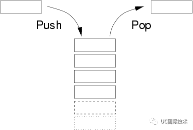
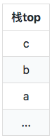

## 深入理解 V8 的 Call Stack

**Call Stack** 与 **Stack** 的概念

**Call Stack(调用栈)** 一般指计算机程序执行时子程序之间消息处理的相互调用产生的一些列函数序列，而且几乎所有的计算机程序都依赖于调用栈。
在探讨 **Call Stack**前，先来搞清楚 **Stack（栈）**的概念。

**Stack** 就是一种特殊的串列形式的数据结构，特殊之处在于只能允许在链接串列或阵列的一端（称为堆叠顶端指标，英语：top）进行加入数据（英语：push）和输出数据（英语：pop）的运算。因此栈的数据结构只允许在一端进行操作，按照后进先出（LIFO，Last In First Out）的原理运行。

;

**Call Stack 是如何运作的**
让我们看看下面的代码:

``` javascript
   function c() {
     console.log('c');
   } 

   function b() {
     c();
     console.log('b');
   }
   function a() {
     debugger;
     b();
     console.log(a);
   }

   a();
```
它的执行结果是:
> c, b, a;

该代码执行过程经历了两个阶段 首先是执行入栈。

执行 a() 方法后，此时 a 就被添加到调用栈的顶部。

在 a 内部调用了 b(),此时的调用栈顶部添加了b;

同样 b 内部调用了 c(),此时的调用栈顶部添加了c， 最终的调用栈变成了;

;

此时 console.log('c');首先被执行。

当执行完 c 后，调用并不就此完成，开始第二阶段的 **出栈**。

b 方法重新获得了线程控制，执行了 console.log('b')。

b 执行完成，栈退到 a 方法上。

执行 console.log('a')。

最后调用完成，调用栈 emptied

**调用栈的大小**

由于操作系统对每组线程的栈内存有一定的限制，为适应线程各种操作系统，所以 Node.js 默认的栈大小为 984k

**总结**

**Call Stack(调用栈)**实际上就是用于存储函数的一种内存数据，而且遵循LIFO 原理实现的进栈和出栈等一系列操作。栈的大小受到操作系统的限制，一般会少于1MB的空间，能使用的回调栈层数受制于栈函数的内部变量数量等不同，调用栈的深浅也不一样。

从我们的开发层看，代码的执行和栈深一般都是有限的，所以默认的情况下代码都不会出现调用栈溢出异常的问题发生。

[文章链接](https://juejin.im/post/5beb840af265da613b6f548b);